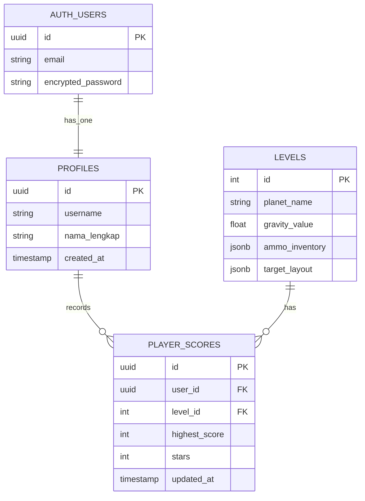

# 🚀 AstroSling: Planetary Physics

AstroSling adalah **game simulasi fisika 2D berbasis web** yang mengajak pemain memahami konsep gravitasi planet, momentum, dan pengaruh massa terhadap pergerakan proyektil.

Pemain menggunakan ketapel untuk meluncurkan berbagai jenis proyektil (kayu, batu, besi) guna menghancurkan target pada lingkungan dengan gravitasi yang berbeda-beda di setiap planet.

Aplikasi dibangun menggunakan arsitektur modern yang memisahkan antarmuka reaktif dari *physics engine* berperforma tinggi sehingga simulasi dapat berjalan secara real-time pada 60 FPS.

---

# ✨ Fitur Utama

* 🔐 Autentikasi pengguna menggunakan Supabase Auth
* 🌍 Level dengan gravitasi berbeda pada setiap planet
* 🪵 Sistem amunisi dengan massa berbeda (Kayu, Batu, Besi)
* 🎯 Simulasi ketapel berbasis hukum fisika
* 💥 Tumbukan realistis menggunakan Matter.js
* ⭐ Sistem penilaian bintang (1–3 Stars)
* 🏆 Leaderboard per level
* 📊 Penyimpanan skor pemain menggunakan PostgreSQL
* ⚡ Single Page Application (SPA) menggunakan Vue Router

---

# 🛠️ Tech Stack

| Kategori             | Teknologi     |
| -------------------- | ------------- |
| Frontend Framework   | Vue 3         |
| Build Tool           | Vite          |
| Routing              | Vue Router 4  |
| Styling              | Tailwind CSS  |
| Physics Engine       | Matter.js     |
| State Management     | Pinia         |
| Backend as a Service | Supabase      |
| Database             | PostgreSQL    |
| Authentication       | Supabase Auth |

---

# 🏗️ Arsitektur Sistem

## 1. Backend as a Service (BaaS)

Frontend Vue 3 berkomunikasi langsung dengan Supabase melalui SDK resmi tanpa memerlukan server backend konvensional.

```text
Vue 3 Client
      │
      ▼
Supabase SDK
      │
      ▼
PostgreSQL Database
```

---

## 2. Singleton Pattern

Instansi Matter.js hanya dibuat satu kali selama aplikasi berjalan.

Tujuan:

* Mencegah duplikasi physics engine
* Mengurangi penggunaan memori
* Menghindari memory leak saat berpindah halaman

Contoh:

```javascript
const engine = Matter.Engine.create();
```

Engine disimpan dalam state global agar dapat digunakan kembali.

---

## 3. State Machine Pattern

Status permainan dikontrol menggunakan Pinia.

```text
INIT
 │
 ▼
MENU
 │
 ▼
PLAYING
 ├────────► GAME_OVER
 │
 └────────► VICTORY
```

State yang digunakan:

* INIT
* MENU
* PLAYING
* GAME_OVER
* VICTORY

---

## 4. Observer Pattern

Matter.js mengirim event ketika terjadi tumbukan.

Vue Components bertindak sebagai observer yang merespons perubahan state tanpa mengganggu proses simulasi fisika.

```javascript
Events.on(engine, 'collisionStart', (event) => {
  // Update skor atau status target
});
```

---

# 📂 Struktur Direktori

```text
📦 astrosling-game
┣ 📂 public
┣ 📂 src
┃ ┣ 📂 assets
┃ ┃ ┗ Sprite, audio, dan aset statis
┃ ┃
┃ ┣ 📂 components
┃ ┃ ┗ Komponen UI reusable
┃ ┃
┃ ┣ 📂 composables
┃ ┃ ┗ Logika reaktif dan integrasi Supabase
┃ ┃
┃ ┣ 📂 engine
┃ ┃ ┗ Physics Engine Matter.js
┃ ┃
┃ ┣ 📂 router
┃ ┃ ┗ Konfigurasi Vue Router
┃ ┃
┃ ┣ 📂 stores
┃ ┃ ┗ Pinia State Management
┃ ┃
┃ ┣ 📂 views
┃ ┃ ┣ LoginView.vue
┃ ┃ ┣ MenuView.vue
┃ ┃ ┗ GameView.vue
┃ ┃
┃ ┣ 📜 App.vue
┃ ┗ 📜 main.js
┃
┣ 📜 package.json
┣ 📜 vite.config.js
┗ 📜 README.md
```

---

# 🗄️ Entity Relationship Diagram (ERD)



---

# 🧮 Konsep Fisika yang Digunakan

## 1. Hukum Hooke (Ketapel)

Gaya yang dihasilkan ketapel bergantung pada jarak tarikan pemain.

```math
F = -k \cdot x
```

Keterangan:

* **F** = Gaya dorong
* **k** = Konstanta elastisitas
* **x** = Jarak tarikan proyektil

---

## 2. Hukum II Newton

Akselerasi dipengaruhi oleh besar gaya dan massa benda.

```math
a = \frac{F}{m}
```

Keterangan:

* **a** = Akselerasi
* **F** = Gaya
* **m** = Massa

---

## 3. Gerak Parabola

Posisi proyektil dihitung berdasarkan kecepatan awal dan gravitasi planet.

```math
x(t)=v_{0x}t
```

```math
y(t)=v_{0y}t-\frac{1}{2}gt^2
```

Keterangan:

* **g** = Gravitasi planet
* **t** = Waktu

---

## 4. Kekekalan Momentum

Digunakan untuk mensimulasikan tumbukan antar objek.

```math
m_1v_1+m_2v_2=m_1v'_1+m_2v'_2
```

Momentum memungkinkan reaksi berantai yang realistis saat target terkena proyektil.

---

# 🔄 Alur Sistem

## Fase 0 — Autentikasi

### Registrasi Pengguna

```javascript
await supabase.auth.signUp({
  email: 'player@email.com',
  password: 'securepassword123',
  options: {
    data: {
      username: 'abidzardz',
      nama_lengkap: 'Abidzar Dzakwan'
    }
  }
});
```

### Login Pengguna

```javascript
await supabase.auth.signInWithPassword({
  email: 'player@email.com',
  password: 'securepassword123'
});
```

### Cek Session

```javascript
const {
  data: { session }
} = await supabase.auth.getSession();
```

---

## Fase 1 — Memuat Data Level

```javascript
const { data: level } = await supabase
  .from('levels')
  .select('planet_name, gravity_value, ammo_inventory')
  .eq('id', currentLevelId)
  .single();

engine.world.gravity.y = level.gravity_value;
```

Data level menentukan:

* Nama planet
* Nilai gravitasi
* Persediaan amunisi
* Layout target

---

## Fase 2 — Gameplay

Seluruh proses simulasi berjalan di sisi klien menggunakan Matter.js.

```text
Tidak ada request API selama gameplay berlangsung.
```

Keuntungan:

* Responsif
* Beban server rendah
* Simulasi 60 FPS

---

## Fase 3 — Penyimpanan Skor

### Simpan Skor

```javascript
await supabase
  .from('player_scores')
  .upsert(
    {
      user_id: session.user.id,
      level_id: currentLevelId,
      highest_score: calculatedScore,
      stars: calculatedStars
    },
    {
      onConflict: 'user_id, level_id'
    }
  );
```

---

### Ambil Leaderboard

```javascript
const { data: leaderboard } = await supabase
  .from('player_scores')
  .select('highest_score, profiles(username)')
  .eq('level_id', currentLevelId)
  .order('highest_score', { ascending: false })
  .limit(10);
```

---


# 🎯 Tujuan Edukasi

AstroSling dirancang sebagai media pembelajaran interaktif untuk membantu pengguna memahami:

* Hukum Newton
* Hukum Hooke
* Gerak Parabola
* Momentum dan Tumbukan
* Pengaruh Massa terhadap Akselerasi
* Pengaruh Gravitasi terhadap Lintasan Benda

melalui pengalaman bermain yang menyenangkan dan berbasis simulasi fisika nyata.

---

## 👥 Anggota Kelompok 1
*   **Improatus Soliha** (20251337006)
*   **Fairuz Abdillah Idrus** (20251337014)
*   **Moh. Faiz Haikal** (20251337015)
*   **Abi Ibryan Naisa Putra** (202513337025)
*   **Wfaa Abdelalem Omer Abdelalem** (20251337031)
*   **Abidzar Dzakwan Sahudi** (20251337037)
